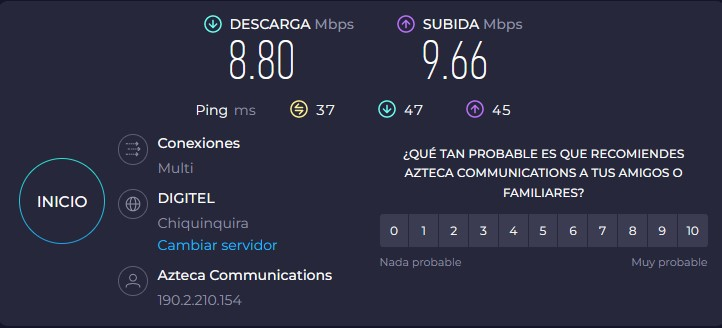
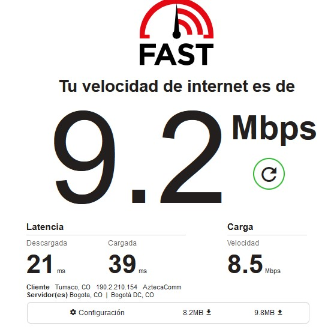
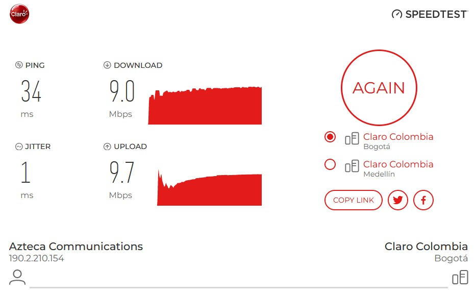
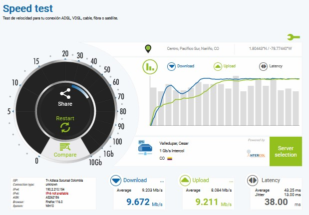

# Laboratorio-1
2.
¿Cual es la dirección de red y de broadcast de un host que tiene una ip 192.168.10.10/30?.

R/La direccion de la red y broadcast.

¿Que información se puede inferir de un host con la dirección 169.254.255.200/26?.

R/se puede inferir todos los bits del host son ceros en la dirección de subred o dirección de transmisión, donde están determinados.

¿Cuantas sub-redes puede lograr con la mascara 172.16.0.0/22?.

R/con la mascara 172.16.0.0/22 Podemos lograr 64 sub-redes y 1022 host

¿Cuantos clientes puede tener la sub red 172.16.0.0/22?.

R/ la cantidad de cliente que puede tener es 1022 ya que es la cantidad de host de la mascara.

¿Que clase y tipo de dirección es 10.10.10.0/24?.

R/Es un tipo de direccion privada que no eccesible atravez de internet porque es local y solo la podemos acceder en la red, pertenese a la Class A network.

3.
|Parámetro||Valor|
|--|:--:|--:|
|Número de adaptadores Físicos|-->|2|
|Número de adaptadores Virtuales|-->|2|
|Tipo de Adaptador principal|-->|Wi-fi|
|Fabricante del Adaptador principal|-->|Qualcomm Atheros|
|Código MAC del fabricante|-->|E4-AA-EA| 
|MAC|-->| E4-AA-EA-88-8A-07|

>Nota: Para obtener los parámetros de la red, usaremos los comandos [ipconfig][10], [ifconfig][8], [getmac][9].

4.
|Parámetro|Valor|
|--|--:|
|__Subnet__|192.168.1.0/24|
|IPv4|192.168.1.6|
|Subnet Mask decimal|24|
|Subnet Mask octetos|255.255.255.0|
|Número de direcciones de Host|254|
|Rango de direcciones de Host|192.168.1.0-254|
|IP Broadcast|192.168.1.255|
|Server DHCP|192.168.1.1|
|Server DNS|192.168.1.1|

>Nota: Para obtener los parámetros de la red, usaremos el comando [ipconfig][10] o [ifconfig][8].

5.
|Parámetro|Valor|
|--|--:|
|Número de Entradas en la tabla ARP |11|
|IPv4 Gateway|192.168.1.1|
|MAC Gateway|a8-bf-3c-06-62-9f|
|ISP|TV AZTECA SUCURSAL COLOMBIA|
|[IP Publica][5]|190.2.210.154|
|[Sistema Autónomo][6]|AS262186|

>Nota: Para obtener los parámetros de la red, usaremos el comando [arp][11] y algún servicio web/HTTP como [cual-es-mi-ip.net][5], [ipinfo.io][6] o [asrank.caida.org][9_1].

6.
|Servidor|IP|Tiempo promedio/ms|
|--|--|--|
|DNS Google|8.8.8.8|24|
|DNS Cloudflare|1.1.1.1|24|
|OpenDNS|208.67.222.222|91|
|Alternate DNS|76.76.19.19|38|
|DNS Quad9|9.9.9.9|24|
|AdGuard DNS|94.140.14.14|173|

>Nota: Para calcular el retardo de la red, usaremos el protocolo ICMP/[ping][12] con al menos 10 paquetes.

7.
|Servidor|Ping/ms|Down/MB|Up/MB|
|--|:--:|--:|--:|
|[speed test][1]|37|8.80|9.66|
|[Netflix][2]|9.2|8.2|9.8|
|[Claro][3]|34|9.0|9.7|
|[nperf][4]|38|9.672|9.211|

>Nota: Para calcular el retardo de la red, usaremos el protocolo HTTP via servicio WEB.

